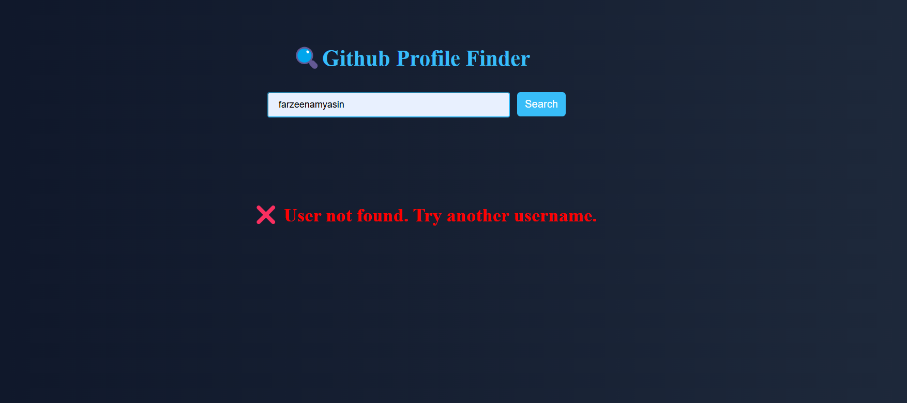
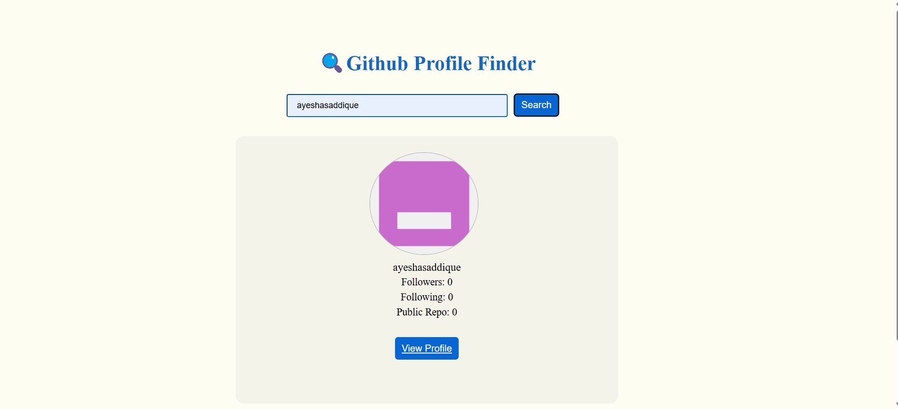

# 🔍 **GitHub Profile Finder**

A simple and powerful web app to search GitHub users and view their profile details instantly using the GitHub API.

---

## 🚀 **Live Demo**

👉 *(https://ayesha-saddique9.github.io/Github-Profile-Finder/)*

---

## 📸 **Project Preview**

### 🔎 Search Interface


### ❌ Error Handling



### 👤 Profile Result



---

## ✨ **Features**

* 🔍 Search any GitHub user
* 👤 Display profile information
* 📊 Followers & Following
* 📁 Public repositories
* 🖼️ Avatar display
* 🔗 Direct profile link
* ❌ Error handling
* ⚡ Fast and simple

---

## 🛠️ **Tech Stack**

* 🧱 HTML
* 🎨 CSS
* ⚙️ JavaScript (Async/Await)
* 🌐 GitHub API

---

## 📂 **Project Structure**

```
github-profile-finder/
│── index.html
│── index.css
│── index.js
│── README.md
│
└── assets/
    ├── search.png
    ├── error.png
    └── profile.png
```

---

## ⚙️ **How It Works**

1. Enter username
2. Click search
3. Fetch data from GitHub API
4. Display user profile
5. Show error if user not found

---

## 💡 **Future Improvements**

* 🌙 Dark mode
* 📱 Responsive design
* ⌨️ Enter key search
* 📍 Location & bio

---

## 🙌 **Author**

👤 Ayesha Saddique
🔗 https://github.com/Ayesha-Saddique9

---

## ⭐ **Support**

If you like this project, give it a ⭐ on GitHub!
